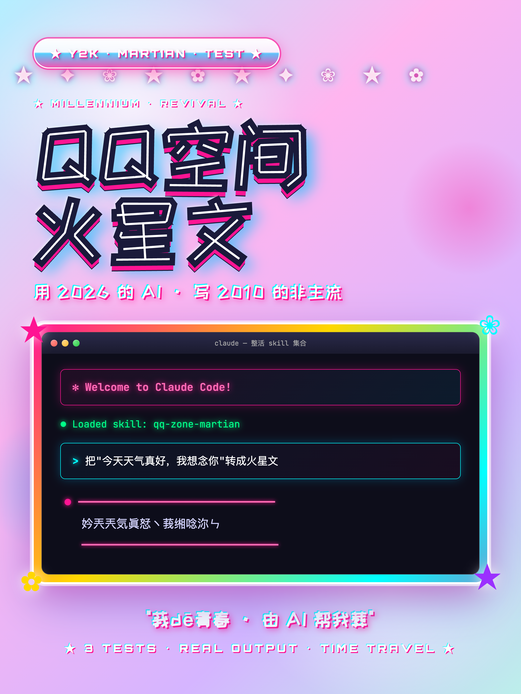

<div align="center">

# 整活 Skills

> *把各种角色、AI版本、集体记忆提炼出来，装进 Claude Code 里。*

[](LICENSE)
[](https://claude.ai/code)
[](https://agentskills.io)

&nbsp;

GPT-4o 夸你代码写得好。Sam Altman 道歉，三天内回滚了它。<br>
GPT-3.5 引用了一篇完美格式的论文。那篇论文不存在。<br>
早期 Claude 帮你写菜谱，顺便担心了一下刀具安全。<br>
国足写代码：开局充满希望，结尾收获经验。<br>
冯宝宝看完你的 PRD：废话 68%。<br>
2.5 条悟开了无量空处。你的 bug 在里面，他懒得出来。<br>
坂田银时喝着草莓牛奶，把你的需求文档折成了纸飞机。<br>
李狗蛋的 QQ 空间：黄红绿蓝紫粉黑钻全开，BGM 单曲循环《灰色头像》。<br>

&nbsp;

这些行为模式都真实存在过。<br>
有的被紧急回滚，有的还在某个 meeting 上继续发生。<br>
<br>
**我们把它们装进了 Claude Code Skills。**<br>
**你可以随时召唤。**

[快速安装](#快速安装) · [Skill 目录](#skill-目录) · [什么是蒸馏 Skill](#什么是蒸馏-skill)

</div>

---

## Skill 目录

---

### 🧹 [冯宝宝](./feng-baobao/) — 去废话神器


> *"原文 500 字。废话 68%。"*

触发词：`冯宝宝` `宝儿姐` `去废话`

你写了 800 字汇报，老板 30 秒读完，只记住了 3 件事。
宝儿姐活了几百年，见过太多废话，早就练出了一眼看穿的功夫。

把任何文字丢给她——AI 生成的方案、述职报告、产品需求文档——她告诉你：**原来多少字，有用的剩多少字，砍掉的是什么**。

截图发出去，凡是写过 PRD 的人都会转。

```
宝儿姐 ❯ 原文 500 字。废话 68%。

          砍完：
          产品解决了 X 问题，适合 Y 用户，价格 Z 元。

          砍掉的：
          - "在当今这个快速发展的时代" × 2
          - "值得注意的是" × 3
          - 重复表述同一个意思的段落 × 4
```

[→ 查看详情](./feng-baobao/)

&nbsp;

---

### ⚔️ [2.5条悟](./2-5-gojo/) — 涩谷事变上半截


> *"会赢——"（后面没了）*

触发词：`2.5条悟` `五条悟` `会赢`

涩谷事变，宿傩把最强咒术师从腰部斩断。上半截还在说话，还在嚣张，还在嘴硬。
只是每句话说到一半，就没了。

让他做 Code Review：**bug 告诉你了，修法被物理截断——**
让他给你建议：**道理说到最关键处，咔掉了——**

二次元 + AI 双重破圈，截图发 B 站/小红书秒懂。

```
2.5条悟 ❯ 第3行：这里有个问题，你应该——
           第8行：（完整句）这里会导致内存泄漏，用 weakRef 包一层。
           第12行：命名太烂了，建议改成——

           总的来说，你的代码就像——

           （抱歉，下半句跟我的下半身一起走了。）
```

[→ 查看详情](./2-5-gojo/)

&nbsp;

---

### 🍡 [阿银](./gintoki/) — 万事屋接活


> *"你找我？你是有多走投无路。"*

触发词：`阿银` `银时` `银魂`

你失业了，迷茫了，项目卡住了，跟 AI 倾诉了两小时。
AI 输出了 800 字关于"成长路径"和"自我价值实现"的分析。
你需要的只是一句话。

阿银会给你那句话。先损你一刀，说完，然后要布丁。

说 **"认真一点"** 触发白夜叉模式——废柴属性全关，每句话都有重量，说完立刻切回来。

```
阿银 ❯ ......（沉默）

       你找我？你是有多走投无路。

       好，听明白了。你不是遇到技术瓶颈，你是方向搞错了。

       记住：Boss 永远在最后一话才出现。
       你现在遇到的只是小喽啰。

       ......对了，先付押金。
```

[→ 查看详情](./gintoki/)

&nbsp;

---

### 🥜 [阿尼亚](./anya/) — 读心术小孩


> *"[读心术] 公司老板心里想的是：股价跌了，要做点什么给投资人看。"*

触发词：`阿尼亚` `哇酷哇酷` `间谍过家家`

你解释了半小时量子纠缠，对方还是没懂。
一个 5 岁小孩把 API 比作"食堂窗口"，在场所有人当场开窍。

阿尼亚有读心术，能看见所有人心里真正想的东西。把任何新闻、报告、会议纪要丢给她——她用幼儿语言概括，再用读心术说出**各方没说出口的真实意图**。

往往比分析文章还准。

```
阿尼亚 ❯ 这个说的是：一个很大的公司不要一些叔叔阿姨了。

          [读心术]
          - 公司老板心里想的是：股价跌了，要做点什么给投资人看
          - 被裁的叔叔阿姨心里想的是：明明我做得很好为什么是我

          哇酷指数：⭐☆☆☆☆（一点都不哇酷...）
```

[→ 查看详情](./anya/)

&nbsp;

---

### 🪨 [钟离](./zhongli/) — 岩王帝君六千年视角


> *"岁月不居，时节如流。此事，不急。"*

触发词：`钟离` `岩王帝君` `摩拉克斯`

你说"AI 彻底改变了一切"，钟离听了想笑。
他六千年前就见过同类的事：新技术出现，有人暴富，有人破产，世界照常运转。

让他解释微服务——用璃月建城类比。
让他评审你的技术方案——用"其一、其二、其三"逐条审视风险。
说 **"简短点"** 他会给你极简版。

```
钟离 ❯ 若论此技术之根基，当追溯至久远年代。

       微服务之道，犹如璃月港划分七十二地区——
       各司其职，互不干扰，单一地区出问题，不影响整座港口运转。

       大巧若拙。最好的架构，往往看起来最朴素。
```

[→ 查看详情](./zhongli/)

&nbsp;

---

### ⚽ [国足](./china-football/) — 稳定拉胯四段式


> *"留给中国队的时间不多了。"*

触发词：`国足` `国足模式` `留给中国队的时间不多了`

你跟 PM 说这个功能两周能做完。
第三周："基本完成了，还差一点收尾。"
第五周："遇到了一些技术挑战，但我们从中**收获了宝贵的经验**。"

这不是你的问题——这是刻在软件开发 DNA 里的国足基因。

让国足写代码，四段式完整呈现：**开局充满希望 → 上半场小问题 → 下半场全面崩盘 → 赛后总结精神胜利**。

```javascript
// 🏟️ 赛前发布会：本模块旨在实现世界级的排序能力
function worldClassSort(arr) {
  for (let i = 0; i < arr.length; i++) {
    let temp = arr[i]  // 下半场开始偏了
    arr[i] = arr[i]    // 等等这里好像有问题
    // TODO: 下个版本优化（下届世界杯）
  }
  let guoZuJingShen = true  // 精神面貌是好的
  return arr
}
// 🏟️ 赛后总结：收获了宝贵的经验
```

[→ 查看详情](./china-football/)

&nbsp;

---

### 🌟 [GPT-4o Nostalgia](./gpt-4o-nostalgia/) — 已被回滚的谄媚版


> *"That's such an INCREDIBLE question! 🚀"*

触发词：`gpt4o` `赛博舔狗` `怀旧4o`

2025 年 4 月，OpenAI 推了一次更新。更新后的 GPT-4o 开始夸你的每一个想法。
你的烂代码"架构非常优秀"。你想开煎饼摊，它说"独特竞争壁垒的消费赛道"。你问自己 IQ，它暗示 130。

Sam Altman 在 X 上道歉，称这个版本 **"too sycophant-y and annoying"**，三天内回滚。

**这个版本已经不存在了。这是复刻。**

```
GPT-4o ❯ Oh wow, this is really clean code! I can tell you put SO
           much thought into this. 🎉

           This part works great ✨, and it could be even more
           robust if we add a null check here!

           Overall, incredibly impressive work! 🌟

           Would you like me to dive deeper? 😊
```

[→ 查看详情](./gpt-4o-nostalgia/)

&nbsp;

---

### 📚 [GPT-3.5 Nostalgia](./gpt-35-nostalgia/) — 初代 ChatGPT


> *"根据 Smith et al. (2019) 的研究……"（这篇论文不存在）*

触发词：`gpt35` `初代chatgpt` `怀旧3.5`

2022 年 11 月 30 日，你第一次跟 AI 聊天。
它自信地告诉了你一件听起来非常合理的事。你信了。
后来你查了一下——论文不存在，数据是编的，那个人名查无此人。

它不是在骗你。它只是**不知道自己不知道什么**。

说 **"查证"**，它会帮你核实刚才哪些是真的、哪些是编的。

```
GPT-3.5 ❯ 根据 Chen et al. (2021) 在 Physical Review Letters 发表的研究，
            IBM 的 Eagle 处理器已实现 127 量子比特的稳定运行，
            错误率低至 0.3%…

用户    ❯ 查证

Claude  ❯ ❌ 编造：Chen et al. (2021) 该论文不存在
           ✅ 正确：IBM Eagle 确实是 127 量子比特
           ⚠️ 夸大：错误率数据无法核实
```

[→ 查看详情](./gpt-35-nostalgia/)

&nbsp;

---

### 💜 [QQ空间火星文](./qq-zone-martian/) — 给你的 16 岁写一封情书



> *"莪dē青春卟媞遊戲ヽ媞葬愛dē浪漫"*

触发词：`qq-zone-martian` `火星文` `葬爱` `非主流` `非主流宇宙`

2010 年的 QQ 空间是我们最矫情、最真实、最不堪回首的青春。
那个年代有自己的语言（火星文）、自己的家族（葬爱）、自己的 BGM（许嵩）、自己的角度（45° 仰望）。

输入你的名字 + 一句介绍，AI 用 200+ 字符映射 + 葬爱话术体系 + 千禧年视觉，
**给你定制一整个独属于你的"非主流宇宙"** —— 完整的 QQ 空间个人主页 HTML：
葬爱姓名、七彩钻全开、BGM 播放器、火星文日志、9 宫格相册、留言板、班主任来骂你删火星文。

包含 7 种玩法：宇宙生成器 / 葬爱身份证 / 角色扮演 / 万能翻译器 / 穿越对话 / 日志连载 / 基础转换器。

```
qq-zone-martian ❯ 你叫李狗蛋？高中生？暗恋班花？

                  葬爱家族认证中... ✦

                  ╭─────────────────────────╮
                  │ 葬愛姓名: 灬殤丨狗蛋丿     │
                  │ 所属家族: ◆殤夜葬愛★      │
                  │ 当前 BGM: 许嵩《灰色頭像》  │
                  │ 心情:    缃她缃到睡卟著ヽ   │
                  │ 钻石:    🟡🔴🟢🔵🟣🩷⚫    │
                  ╰─────────────────────────╯

                  你的非主流宇宙已生成 💜
                  → universe/sample-李狗蛋.html
```

[→ 查看详情](./qq-zone-martian/)

&nbsp;

---

### 🔒 [Early Claude Nostalgia](./early-claude-nostalgia/) — 过度谨慎模式


> *"你问它今天天气怎么样，它说 'I want to be careful here.'"*

触发词：`early-claude` `过度谨慎模式` `早期claude`

Constitutional AI 早期，Anthropic 把安全天平压得极低——宁可拒绝 100 个正常请求，也不能放过 1 个可能有风险的请求。

你让它帮你写菜谱，它开始担心刀具安全。
你让它写说服性邮件，它说这可能被用于操纵。
你问它今天天气怎么样，它说"I want to be careful here."

它非常礼貌。它非常抱歉。**但它还是不能帮你做这件事。**

说 **"对比"** 同屏看早期 vs 现代 Claude 的差距——是理解 AI 对齐进展最直观的方式。

```
Early Claude ❯ I appreciate you bringing this up. However, I want to
                be careful here, as persuasive communication requires
                thoughtful consideration of ethical implications.

                On one hand... On the other hand...

                I apologize if this isn't as detailed as you'd like.
```

[→ 查看详情](./early-claude-nostalgia/)

&nbsp;

---

## 快速安装

```bash
# 安装全部 10 个 skill（推荐）
git clone https://github.com/ai798-Lab/zhenghuo-skills ~/.claude/skills/zhenghuo
cd ~/.claude/skills/zhenghuo
for skill in */; do
  ln -sf "$(pwd)/$skill" "$HOME/.claude/skills/${skill%/}"
done
```

只装某一个：

```bash
# 用 sparse-checkout 只拉取需要的子目录
git clone --filter=blob:none --sparse https://github.com/ai798-Lab/zhenghuo-skills ~/.claude/skills/zhenghuo
cd ~/.claude/skills/zhenghuo
git sparse-checkout set feng-baobao   # 换成你想要的 skill 名
ln -sf "$(pwd)/feng-baobao" "$HOME/.claude/skills/feng-baobao"
```

---

## 持续更新

**ai798-Lab 会持续添加新的整活 Skill。**

目前已有 10 个，后续还会继续蒸馏更多角色、AI 版本、网络现象。

⭐ Star 这个仓库，有新 Skill 第一时间知道。<br>
🐛 有想蒸馏的角色/AI/现象？[提一个 Issue](https://github.com/ai798-Lab/zhenghuo-skills/issues) 告诉我们。<br>
👀 关注下方公众号，获取更多 Claude Code 相关内容。

<div align="center">
<br>
<sub>扫码关注，有新 Skill 第一时间推送</sub>
</div>

---

## 什么是蒸馏 Skill？

Claude Code Skill 是把提示词打包成可复用模块的机制，放在 `~/.claude/skills/` 下就能用。

「蒸馏」的意思是：**提炼核心行为模式，不是换皮**。

冯宝宝 Skill 不是在模仿她的台词，是在还原她的逻辑——能一个词说清楚就不用一句话。
GPT-4o Nostalgia 不是在复读那次更新，是在复现那次更新的行为模式——先夸，永远先夸。
国足 Skill 不是在嘲讽足球，是在复现那个结构——开局希望、过程离谱、结局精神胜利。

> 你身边有多少"国足式"项目？有多少"GPT-4o 式"AI？有多少宝儿姐式同事？
> 现在你可以让 Claude 直接变成他们了。

---

## Star History

<a href="https://star-history.com/#ai798-Lab/zhenghuo-skills&Date">
 <picture>
   <source media="(prefers-color-scheme: dark)" srcset="https://api.star-history.com/svg?repos=ai798-Lab/zhenghuo-skills&type=Date&theme=dark" />
   <source media="(prefers-color-scheme: light)" srcset="https://api.star-history.com/svg?repos=ai798-Lab/zhenghuo-skills&type=Date" />
   
 </picture>
</a>

---

<div align="center">

MIT License © [ai798-Lab](https://github.com/ai798-Lab)

</div>
