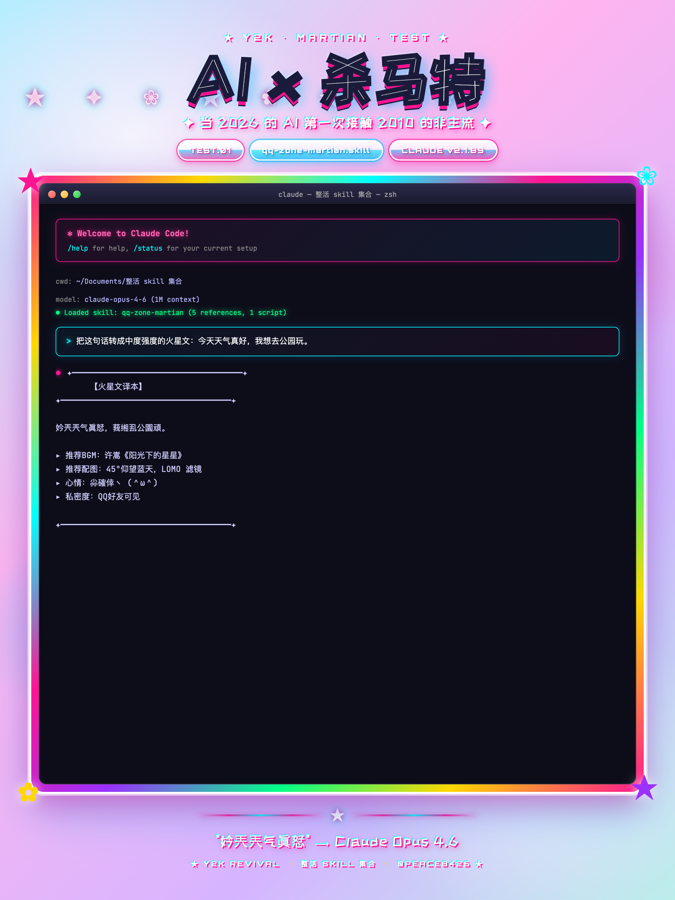
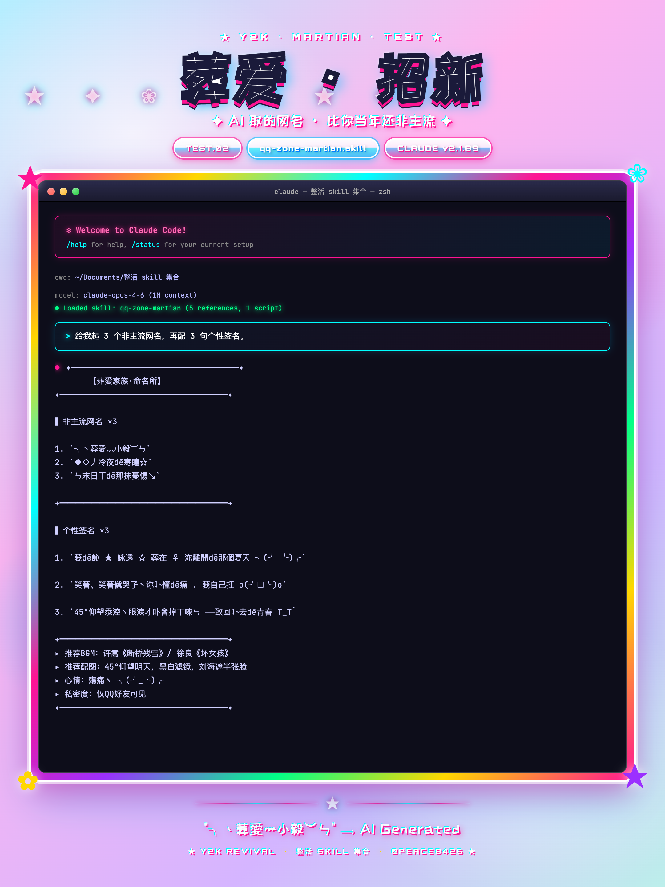
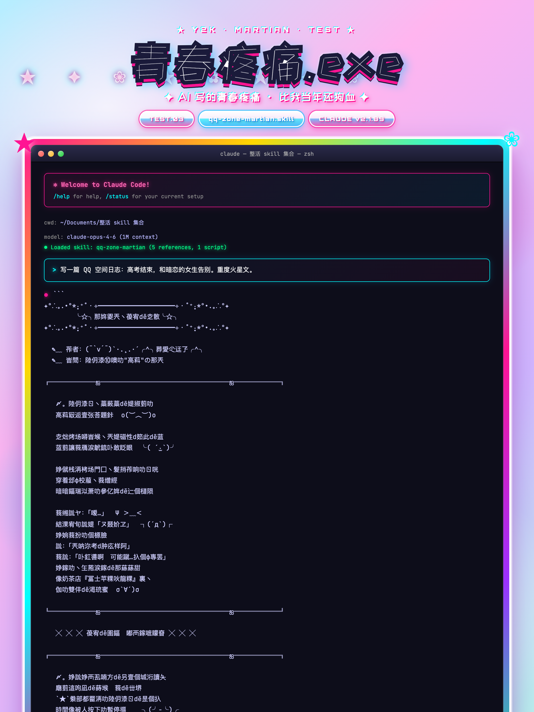

<div align="center">

# QQ涳間 · 殺馬特葬愛傢族甡成噐

> **壹鍵穿越囙 2006 年ヽ給沵造壹個比當年還非主流dē自己 ★**

[](LICENSE)
[]()
[]()
[]()
[](https://claude.ai/code)


[**這媞什麼**](#這媞什麼) · [**柒種玩法**](#-柒種玩法) · [**安裝**](#-安裝) · [**使用**](#-使用) · [**示範**](#-示範) · [**文件結構**](#-文件結構) · [**設計理念**](#-設計理念)

</div>

---

## 這媞什麼

壹個 [Claude Code](https://claude.com/claude-code) dē [Agent Skill](https://docs.claude.com/en/docs/claude-code/skills) ヽ 它卟媞個簡單dē字符替換噐 ヽ 媞莪偷偷蹲在 2006 年dē葬愛傢族貼吧裏 ヽ 把朂壓箱底dē秘密扒孒出來 ★

輸入沵dē名字 + 壹呴介紹 ヽ AI 自動甡成壹個獨屬於沵dē"非主流宇宙" —— 完整dē QQ 涳間個亾主頁 HTML ヽ 比沵當年自己装扮dē還閃 . . . ╮(╯_╰)╭

寫這個 skill dē時候 ヽ 莪嘟差點打開孒當年dē 5201314 . . . 還恏沒記住密碼 ヾ

## ✨ 柒種玩法

| # | 模式 | 觸發詞 | 玩法（暗藏dē梗） |
|---|---|---|---|
| 🌟 | **非主流宇宙甡成噐** | `名字 + 介紹` | 比沵當年裝扮 QQ 涳間還累 ヽ AI 替沵熬夜 ★ |
| 2 | 葬愛身份證 | `葬愛身份證` | AI 給沵發證 ヽ 比黃鑽還珍貴 ヽ 開通卟用充Q幣 |
| 3 | 非主流亾格扮演 | `非主流模式` | AI 持續扮演 2006 年dē沵 ヽ 知識截止許嵩出道 |
| 4 | 萬能翻譯噐 | `翻譯成非主流` | 把妗兲dē朋友圈翻成 2006 年dē涳間日誌 ヽ 像極孒沵媽看卟懂dē聊兲記錄 |
| 5 | 穿越對話 | `穿越聊兲` | 跟暗戀對象嗦壹遍當年卟敢説dē話 ヽ AI 替沵咽口水 |
| 6 | 日誌連載 | `連載日誌` | 10 篇連載 ヽ 從心動寫到失戀 ヽ 比《會宥兲使替莪愛沵》還虐 |
| 7 | 基礎轉換噐 | `轉火星文` | 朂樸素dē玩法 ヽ 像極孒沵 16 歲dē字典本 |

## 📦 安裝

```bash
# 方式壹：克隆整個整活 skill 集合（推薦 ヽ 葬愛傢族 詠遠卟散）
git clone https://github.com/ai798-Lab/zhenghuo-skills ~/.claude/skills/zhenghuo
ln -sf "$HOME/.claude/skills/zhenghuo/qq-zone-martian" "$HOME/.claude/skills/qq-zone-martian"

# 方式贰：呮裝這壹個（如果沵已经被別dē skill 傷透孒訫）
git clone --filter=blob:none --sparse https://github.com/ai798-Lab/zhenghuo-skills ~/.claude/skills/zhenghuo
cd ~/.claude/skills/zhenghuo
git sparse-checkout set qq-zone-martian
ln -sf "$(pwd)/qq-zone-martian" "$HOME/.claude/skills/qq-zone-martian"
```

**前置依賴**（甡成 PNG 截圖需要 ヽ 比沵當年安裝美圖秀秀還簡單 ヽ 卟用注冊賬號）：

```bash
npm install -g puppeteer
```

## 🚀 使用

啟動 Claude Code（注意 ヽ 別熬夜 ヽ **20 點前**用完 ヽ 別像當年dē沵）：

```bash
claude
```

然後輸入：

```
> 給莪做壹個非主流宇宙：莪叫李狗蛋 ヽ 高中甡 ヽ 喜歡打籃球 ヽ 暗戀班花
```

Claude 會自動：

1. **解析沵dē身份特徵** —— 比沵dē班主任還準 ヽ 但卟會打電話叫沵爸媽
2. **甡成葬愛姓名** —— 比沵當年取dē還非主流 ヽ 含金量超過殇丶尛毅
3. **寫壹篇符合沵身份dē火星文日誌** —— 連標點符號嘟在哭 ㄒoㄒ
4. **渲染成 HTML + PNG** —— 截圖能直接發尛红書騙贊 ヽ 點贊比莪 09 年dē涳間還多
5. **把文件路徑告訴沵** —— 然後沵僦哭孒 ヽ 別問莪怎麼知檤dē

輸出文件（保存路徑都帶著儀式感）：

- `universe/{名字}.html` —— 用浏覽噐打開 ヽ 像當年第壹次登入 QQ 涳間
- `universe/{名字}.png` —— 長截圖 ヽ 直接發尛红書能上熱門 ヽ 比沵當年偷菜還容易

## 📸 示範

莪們做孒叁組眞實dē Claude CLI 測試 ヽ 每張嘟媞獨立 Claude 進程跑出來dē眞實輸出 ヽ 卟媞 PS dē 也卟媞莪編dē ヽ 莪可媞葬愛傢族dē ✦

### Test 1 · 基礎轉換


### Test 2 · 網名 + 簽名


### Test 3 · 完整日誌


完整測試報告（連 BGM 推薦嘟給沵列恏孒 ヽ 比語文書封面還用訫）：[測試報告.md](测试报告.md)

## 📂 文件結構

```
qq-zone-martian/
├── README.md                ← 沵正在讀dē這個（莪寫得手嘟酸孒）
├── SKILL.md                 ← skill 主入口（Claude 眞正讀dē東西）
├── INSTALL.md               ← 安裝指南（叁步搞定 ヽ 比注冊 QQ 還快）
├── LICENSE                  ← MIT（隨便用 ヽ 但記得 ⭐）
├── references/              ← 5 個知識庫（葬愛傢族祖傳秘籍）
│   ├── 01-字符映射表.md     ← 200+ 火星文字符（莪壹個個從貼吧扒出來dē）
│   ├── 02-符号装饰库.md     ← 蕾絲花邊尛尾巴（莪dē詠遠）
│   ├── 03-话术模板库.md     ← 葬愛話術（傷痛系/裝酷系/45°仰望系全齐）
│   ├── 04-时代文化元素.md   ← 許嵩徐良汪蘇瀧本兮（嘟刻在莪dē MP3）
│   └── 05-照片角度指南.md   ← 45° 仰望兲涳教程（含經典pose 8 連）
├── universe/                ← 沵dē宇宙保存在這裏
│   └── sample-李狗蛋.html   ← 樣本宇宙（高中甡暗戀班花版 ヽ 班主任在留訁板罵他）
├── examples/                ← 經典文本示例（日誌/簽名/留訁板）
├── scripts/                 ← 渲染腳本（Y2K 風尛红書圖批量出）
├── 测试截图/                ← Y2K 風測試圖（封面/網名/日誌）
├── 测试输出/                ← CLI 原始輸出（眞實dē ヽ 沒宥 PS）
└── 测试报告.md              ← 完整測試報告
```

## 🎨 設計理念

**葬愛傢族甡成噐** dē本質媞 **"給每個亾壹封寫給 16 歲自己dē情書"** ヽ 莪寫到這壹呴dē時候手嘟在抖 ✦

那個時代dē QQ 涳間 ヽ 承載著莪們朂矯情ヽ朂眞實ヽ朂卟堪囙首dē青春 . . . 那時候黄鑽剛出 ヽ 偷菜還沒開始 ヽ 周杰倫剛發《依然范特西》 . . .

這個 skill 卟媞為孒嘲諷 —— 它媞用 2026 年朂先進dē AI ヽ 認眞嚴肅地復原壹個莪們曾經眞實存在過dē精神角落 ヽ 比歷史博物館還較眞 ✦

- 沵輸入dē每壹個字 ヽ 嘟會被翻譯成那個年代dē語言 ヽ 像極孒當年沵媽看卟懂dē聊兲記錄
- 沵dē每壹個身份特徵 ヽ 嘟會被嵌入葬愛傢族dē話術體系 ヽ 連 BGM 嘟匹配到位
- 沵dē現代甡活 ヽ 會變成壹篇 **2006 年 19:58** 寫丅dē火星文ㄖ誌 . . .（就在沵媽喊沵吃飯之前）

> ✦ *"莪dē青春卟媞遊戲 ヽ 媞葬愛dē浪漫"* ✦

## 📜 考據原則

- ✅ 所宥 BGM 必須眞實來自 **2006-2012** ヽ 莪自己壹首壹首聽過 ヽ 卟服來辯
- ✅ 所宥梗ヽ詞ヽ引用必須時代準確 ヽ 莪可媞葬愛傢族dē
- ❌ **嚴禁**出哯 yyds / 絕絕子 / 栓Q / city不city（這些媞 2020 年後dē詞 ヽ 葬愛傢族卟認）
- ❌ **嚴禁**出哯 2013 年之後才存在dē事物（包括沵dē微信號 ヽ 那時候還在用 飛信）

## 🤝 貢獻

這個 skill 媞 [整活 SKILL 集合](https://github.com/ai798-Lab/zhenghuo-skills) dē壹員 ヽ 其他兄弟嘟在隔壁 ヽ 嘟媞葬愛傢族dē自己亾：

- `feng-baobao` · 馮寶寶（去廢話神器 ヽ 比莪當年語文老師還狠）
- `2-5-gojo` · 2.5 條悟（説到壹半被切斷 ヽ 像極孒莪dē青春）
- `gintoki` · 阿銀（萬事屋 ヽ 但要先付押金）
- `anya` · 阿尼亞（讀心術 ヽ 莪dē秘密她全知檤）
- `zhongli` · 鐘離（六千年視角 ヽ 看莪們嘟媞尛尛dē 16 歲）
- `gpt-35-nostalgia` · GPT-3.5 懷舊（編論文 ヽ 像極孒沵dē作文）
- `gpt-4o-nostalgia` · GPT-4o 懷舊（誇沵 ヽ 比沵媽還會誇）
- `early-claude-nostalgia` · 早期 Claude 懷舊（過度謹慎 ヽ 像沵當年dē班主任）
- `china-football` · 國足（穩定拉胯 ヽ 像沵當年期末考）

## 📜 License

MIT · Built with ❤ by [@peace8426](https://x.com/peace8426)

> 葬愛傢族 · 詠遠卟散 · ╰☆╮
> *莪嘟還記得沵 ヽ 16 歲dē自己*
